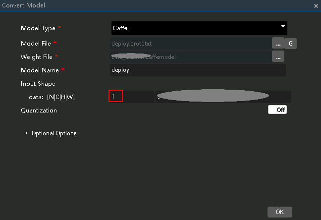

EN|[CN](README_cn.md)

The classification classification application runs on the Atlas 200 DK or the AI acceleration cloud server and implements the inference function by using a common classification network, and the first  _n_  inference results are output.

## Prerequisites

Before using an open source application, ensure that:

-   MindSpore Studio has been installed.
-   The Atlas 200 DK developer board has been connected to MindSpore Studio, the cross compiler has been installed, the SD card has been prepared, and basic information has been configured. 

## Software Preparation

Before running the application, obtain the source code package and configure the environment as follows.

1.  Obtain the source code package.

    Download all the code in the sample-classification repository at  [https://github.com/Ascend/sample-classification](https://github.com/Ascend/sample-classification)  to any directory on Ubuntu Server where MindSpore Studio is located as the MindSpore Studio installation user, for example,  _/home/ascend/sample-classification_.

2.  Log in to Ubuntu Server where MindSpore Studio is located as the MindSpore Studio installation user and set the environment variable  **DDK\_HOME**.

    **vim \~/.bashrc**

    Run the following commands to add the environment variables  **DDK\_HOME**  and  **LD\_LIBRARY\_PATH**  to the last line:

    **export DDK\_HOME=/home/XXX/tools/che/ddk/ddk**

    **export LD\_LIBRARY\_PATH=$DDK\_HOME/uihost/lib**

    > **NOTE:**   
    >-   **XXX**  indicates the MindSpore Studio installation user, and  **/home/XXX/tools**  indicates the default installation path of the DDK.  
    >-   If the environment variables have been added, skip this step.  

    Enter  **:wq!**  to save and exit.

    Run the following command for the environment variable to take effect:

    **source \~/.bashrc**

## Deployment

1.  Access the root directory where the classification application code is located as the MindSpore Studio installation user, for example,  _**/home/ascend/sample-classification**_.
2.  Run the deployment script to prepare the project environment, including compiling and deploying the ascenddk public library and application.

    bash deploy.sh  _host\_ip_ _model\_mode_

    -   _host\_ip_: For the Atlas 200 DK developer board, this parameter indicates the IP address of the developer board.For the AI acceleration cloud server, this parameter indicates the IP address of the host.
    -   _model\_mode_  indicates the deployment mode of the model file. The default setting is  **internet**.
        -   **local**: If the Ubuntu system where MindSpore Studio is located is not connected to the network, use the local mode. In this case, download the dependent common code library ezdvpp to the  **sample-classification/script**  directory by referring to the  [Downloading Network Models and and Dependency Code Library](#en-us_topic_0167438951_section13446115712539).
        -   **internet**: Indicates the online deployment mode. If the Ubuntu system where MindSpore Studio is located is connected to the network, use the Internet mode. In this case, download the dependency code library ezdvpp online.

    Example command:

    **bash deploy.sh 192.168.1.2 internet**

3.  Upload the offline model file to be used and the image which requires inference to the directory of the  **HwHiAiUser**  user on the Host. For details, see  [Downloading Network Models and and Dependency Code Library](#en-us_topic_0167438951_section13446115712539).

    For example, upload the model file  **alexnet.om**  to the  **/home/HwHiAiUser/models**  directory on the host.

    The image requirements are as follows:
    - Format: JPG, PNG, and BMP.
    - Width of the input image: the value is an integer ranging from 16px to 4096px.
    - Height of the input image: the value is an integer ranging from 16px to 4096px.

## Running

1.  Log in to the Host as the  **HwHiAiUser**  user in SSH mode on Ubuntu Server where MindSpore Studio is located.

    **ssh HwHiAiUser@**_host\_ip_

    For the Atlas 200 DK, the default value of  _**host\_ip**_  is  **192.168.1.2**  \(USB connection mode\) or  **192.168.0.2**  \(NIC connection mode\).

    For the AI acceleration cloud server,  _**host\_ip**_  indicates the IP address of the server where MindSpore Studio is located.

2.  Go to the path of the executable file of classification application.

    **cd \~/HIAI\_PROJECTS/ascend\_workspace/classification/out**

3.  Run the application.

    Run the  **run\_classification.py**  script to print the inference result on the execution terminal.

    Example command:

    **python3 run\_classification.py -m  _\~/models/vgg16.om_  -w  _224_  -h  _224_  -i**

    **_./example.jpg_  -n  _10_**

    -   **-m/--model\_path**: path for storing offline models
    -   **-w/model\_width**: width of the input image of a model. The value is an integer ranging from 16 to 4096.
    -   **-h/model\_height**: height of the input image of a model. The value is an integer ranging from 16 to 4096.
    -   **-i/input\_path**: path of the input image. It can be a directory, indicating that all images in the current directory are used as input. \(Multiple inputs can be specified\).
    -   **-n/top\_n**: the first  _n_  inference results that are output

    For other parameters, run the  **python3 run\_classification.py --help**  command. For details, see the help information.

## Downloading Network Models and and Dependency Code Library

-   Downloading network models

    The models used in the application are converted models that adapt to the Ascend 310 chipset. For details about how to download this kind of models and the original network models, see  [Table 1](#en-us_topic_0167438951_table0531392153). If you have a better model solution, you are welcome to share it at  [https://github.com/Ascend/models](https://github.com/Ascend/models).

    Upload the network model files (.om files) to the directory of the  **HwHiAiUser**  user on the Host.

    **Table  1**  Models used in Classification Application

    
    <table><thead align="left"><tr id="en-us_topic_0167438951_row1154103991514"><th class="cellrowborder" valign="top" width="15.841584158415841%" id="mcps1.2.5.1.1">
Model Name

    </th>
    <th class="cellrowborder" valign="top" width="21.782178217821784%" id="mcps1.2.5.1.2">
Description

    </th>
    <th class="cellrowborder" valign="top" width="28.71287128712871%" id="mcps1.2.5.1.3">
Model Download Path

    </th>
    <th class="cellrowborder" valign="top" width="33.663366336633665%" id="mcps1.2.5.1.4">
Original Network Download Address

    </th>
    </tr>
    </thead>
    <tbody><tr id="en-us_topic_0167438951_row46451053974"><td class="cellrowborder" valign="top" width="15.841584158415841%" headers="mcps1.2.5.1.1 ">
Image classification inference model (<strong id="en-us_topic_0167438951_b145645810435">alexnet.om</strong>)

    </td>
    <td class="cellrowborder" valign="top" width="21.782178217821784%" headers="mcps1.2.5.1.2 ">
This model is used in the <strong id="en-us_topic_0167438951_b33551153115614">classification application</strong> application.

    
It is an AlexNet model based on Caffe.

    </td>
    <td class="cellrowborder" valign="top" width="28.71287128712871%" headers="mcps1.2.5.1.3 ">
Download the model from the <strong id="en-us_topic_0167438951_b927977407">computer_vision/classification/alexnet</strong> directory in the <a href="https://github.com/Ascend/models/" target="_blank" rel="noopener noreferrer">https://github.com/Ascend/models/</a> repository.

    
For the version description, see the <strong id="en-us_topic_0167438951_b116611920124613">README.md</strong> file in the current directory.

    </td>
    <td class="cellrowborder" valign="top" width="33.663366336633665%" headers="mcps1.2.5.1.4 ">
For details, see the <strong id="en-us_topic_0167438951_b7661623134619">README.md</strong> file of the <strong id="en-us_topic_0167438951_b19661223174616">computer_vision/classification/alexnet</strong> directory in the <a href="https://github.com/Ascend/models/" target="_blank" rel="noopener noreferrer">https://github.com/Ascend/models/</a> repository.

    
<strong id="en-us_topic_0167438951_b1026464240">Precautions during model conversion:</strong>

    
The classification application processes one picture at a time. Therefore, the value of N in <strong id="en-us_topic_0167438951_b208905419213">Input Shaple</strong> needs to be changed to 1 during conversion, as shown in <a href="#en-us_topic_0167438951_fig20240124719920">Figure 1</a>.

    </td>
    </tr>
    <tr id="en-us_topic_0167438951_row159579101382"><td class="cellrowborder" valign="top" width="15.841584158415841%" headers="mcps1.2.5.1.1 ">
Image classification inference model (<strong id="en-us_topic_0167438951_b1098923719462">caffenet.om</strong>)

    </td>
    <td class="cellrowborder" valign="top" width="21.782178217821784%" headers="mcps1.2.5.1.2 ">
This model is used in the <strong id="en-us_topic_0167438951_b1339518579">classification</strong> application.

    
It is a CaffeNet model based on Caffe.

    </td>
    <td class="cellrowborder" valign="top" width="28.71287128712871%" headers="mcps1.2.5.1.3 ">
Download the model from the <strong id="en-us_topic_0167438951_b43333586461">computer_vision/classification/caffenet</strong> directory in the <a href="https://github.com/Ascend/models/" target="_blank" rel="noopener noreferrer">https://github.com/Ascend/models/</a> repository.

    
For the version description, see the <strong id="en-us_topic_0167438951_b1729101124719">README.md</strong> file in the current directory.

    </td>
    <td class="cellrowborder" valign="top" width="33.663366336633665%" headers="mcps1.2.5.1.4 ">
For details, see the <strong id="en-us_topic_0167438951_b2276171444719">README.md</strong> file of the <strong id="en-us_topic_0167438951_b927631424718">computer_vision/classification/caffenet</strong> directory in the <a href="https://github.com/Ascend/models/" target="_blank" rel="noopener noreferrer">https://github.com/Ascend/models/</a> repository.

    
<strong id="en-us_topic_0167438951_b842092220233">Precautions during model conversion:</strong>

    
The classification application processes one picture at a time. Therefore, the value of N in <strong id="en-us_topic_0167438951_b1542062212238">Input Shaple</strong> needs to be changed to 1 during conversion, as shown in <a href="#en-us_topic_0167438951_fig20240124719920">Figure 1</a>.

    </td>
    </tr>
    <tr id="en-us_topic_0167438951_row316892191110"><td class="cellrowborder" valign="top" width="15.841584158415841%" headers="mcps1.2.5.1.1 ">
Image classification inference model (<strong id="en-us_topic_0167438951_b176196308471">densenet.om</strong>)

    </td>
    <td class="cellrowborder" valign="top" width="21.782178217821784%" headers="mcps1.2.5.1.2 ">
This model is used in the <strong id="en-us_topic_0167438951_b638618915573">classification</strong> application.

    
It is a DenseNet121 model based on Caffe.

    </td>
    <td class="cellrowborder" valign="top" width="28.71287128712871%" headers="mcps1.2.5.1.3 ">
Download the model from the <strong id="en-us_topic_0167438951_b172608531476">computer_vision/classification/densenet</strong> directory in the <a href="https://github.com/Ascend/models/" target="_blank" rel="noopener noreferrer">https://github.com/Ascend/models/</a> repository.

    
For the version description, see the <strong id="en-us_topic_0167438951_b194221553486">README.md</strong> file in the current directory.

    </td>
    <td class="cellrowborder" valign="top" width="33.663366336633665%" headers="mcps1.2.5.1.4 ">
For details, see the <strong id="en-us_topic_0167438951_b939119864818">README.md</strong> file of the <strong id="en-us_topic_0167438951_b43915844818">computer_vision/classification/densenet</strong> directory in the <a href="https://github.com/Ascend/models/" target="_blank" rel="noopener noreferrer">https://github.com/Ascend/models/</a> repository.

    </td>
    </tr>
    <tr id="en-us_topic_0167438951_row13785115171113"><td class="cellrowborder" valign="top" width="15.841584158415841%" headers="mcps1.2.5.1.1 ">
Image classification inference model (<strong id="en-us_topic_0167438951_b2032736144815">googlenet.om</strong>)

    </td>
    <td class="cellrowborder" valign="top" width="21.782178217821784%" headers="mcps1.2.5.1.2 ">
This model is used in the <strong id="en-us_topic_0167438951_b1868361815579">classification</strong> application.

    
It is a GoogLeNet model based on Caffe.

    </td>
    <td class="cellrowborder" valign="top" width="28.71287128712871%" headers="mcps1.2.5.1.3 ">
Download the model from the <strong id="en-us_topic_0167438951_b10657105310488">computer_vision/classification/googlenet</strong> directory in the <a href="https://github.com/Ascend/models/" target="_blank" rel="noopener noreferrer">https://github.com/Ascend/models/</a> repository.

    
For the version description, see the <strong id="en-us_topic_0167438951_b935017311496">README.md</strong> file in the current directory.

    </td>
    <td class="cellrowborder" valign="top" width="33.663366336633665%" headers="mcps1.2.5.1.4 ">
For details, see the <strong id="en-us_topic_0167438951_b118971848492">README.md</strong> file of the <strong id="en-us_topic_0167438951_b089744114912">computer_vision/classification/googlenet</strong> directory in the <a href="https://github.com/Ascend/models/" target="_blank" rel="noopener noreferrer">https://github.com/Ascend/models/</a> repository.

    
<strong id="en-us_topic_0167438951_b59379285232">Precautions during model conversion:</strong>

    
The classification application processes one picture at a time. Therefore, the value of N in <strong id="en-us_topic_0167438951_b199371728202320">Input Shaple</strong> needs to be changed to 1 during conversion, as shown in <a href="#en-us_topic_0167438951_fig20240124719920">Figure 1</a>.

    </td>
    </tr>
    <tr id="en-us_topic_0167438951_row8741916780"><td class="cellrowborder" valign="top" width="15.841584158415841%" headers="mcps1.2.5.1.1 ">
Image classification inference model (<strong id="en-us_topic_0167438951_b81005144491">inception_v2.om</strong>)

    </td>
    <td class="cellrowborder" valign="top" width="21.782178217821784%" headers="mcps1.2.5.1.2 ">
This model is used in the <strong id="en-us_topic_0167438951_b1113613266572">classification</strong> application.

    
It is an Inception V2 model based on Caffe.

    </td>
    <td class="cellrowborder" valign="top" width="28.71287128712871%" headers="mcps1.2.5.1.3 ">
Download the model from the <strong id="en-us_topic_0167438951_b695953310491">computer_vision/classification/inception_v2</strong> directory in the <a href="https://github.com/Ascend/models/" target="_blank" rel="noopener noreferrer">https://github.com/Ascend/models/</a> repository.

    
For the version description, see the <strong id="en-us_topic_0167438951_b196009442498">README.md</strong> file in the current directory.

    </td>
    <td class="cellrowborder" valign="top" width="33.663366336633665%" headers="mcps1.2.5.1.4 ">
For details, see the <strong id="en-us_topic_0167438951_b336635014910">README.md</strong> file of the <strong id="en-us_topic_0167438951_b63668504490">computer_vision/classification/inception_v2</strong> directory in the <a href="https://github.com/Ascend/models/" target="_blank" rel="noopener noreferrer">https://github.com/Ascend/models/</a> repository.

    
<strong id="en-us_topic_0167438951_b1354183416239">Precautions during model conversion:</strong>

    
The classification application processes one picture at a time. Therefore, the value of N in <strong id="en-us_topic_0167438951_b10541341239">Input Shaple</strong> needs to be changed to 1 during conversion, as shown in <a href="#en-us_topic_0167438951_fig20240124719920">Figure 1</a>.

    </td>
    </tr>
    <tr id="en-us_topic_0167438951_row9866134420103"><td class="cellrowborder" valign="top" width="15.841584158415841%" headers="mcps1.2.5.1.1 ">
Image classification inference model (<strong id="en-us_topic_0167438951_b10741115834910">inception_v3.om</strong>)

    </td>
    <td class="cellrowborder" valign="top" width="21.782178217821784%" headers="mcps1.2.5.1.2 ">
This model is used in the <strong id="en-us_topic_0167438951_b1641843475711">classification</strong> application.

    
It is an Inception V3 model based on Caffe.

    </td>
    <td class="cellrowborder" valign="top" width="28.71287128712871%" headers="mcps1.2.5.1.3 ">
Download the model from the <strong id="en-us_topic_0167438951_b91532136500">computer_vision/classification/inception_v3</strong> directory in the <a href="https://github.com/Ascend/models/" target="_blank" rel="noopener noreferrer">https://github.com/Ascend/models/</a> repository.

    
For the version description, see the <strong id="en-us_topic_0167438951_b5950192465014">README.md</strong> file in the current directory.

    </td>
    <td class="cellrowborder" valign="top" width="33.663366336633665%" headers="mcps1.2.5.1.4 ">
For details, see the <strong id="en-us_topic_0167438951_b142001227155012">README.md</strong> file of the <strong id="en-us_topic_0167438951_b7200192725012">computer_vision/classification/inception_v3</strong> directory in the <a href="https://github.com/Ascend/models/" target="_blank" rel="noopener noreferrer">https://github.com/Ascend/models/</a> repository.

    </td>
    </tr>
    <tr id="en-us_topic_0167438951_row17465348111014"><td class="cellrowborder" valign="top" width="15.841584158415841%" headers="mcps1.2.5.1.1 ">
Image classification inference model (<strong id="en-us_topic_0167438951_b1374716368505">inception_v4.om</strong>)

    </td>
    <td class="cellrowborder" valign="top" width="21.782178217821784%" headers="mcps1.2.5.1.2 ">
This model is used in the <strong id="en-us_topic_0167438951_b5293154116575">classification</strong> application.

    
It is an Inception V4 model based on Caffe.

    </td>
    <td class="cellrowborder" valign="top" width="28.71287128712871%" headers="mcps1.2.5.1.3 ">
Download the model from the <strong id="en-us_topic_0167438951_b2015335519506">computer_vision/classification/inception_v4</strong> directory in the <a href="https://github.com/Ascend/models/" target="_blank" rel="noopener noreferrer">https://github.com/Ascend/models/</a> repository.

    
For the version description, see the <strong id="en-us_topic_0167438951_b229915613518">README.md</strong> file in the current directory.

    </td>
    <td class="cellrowborder" valign="top" width="33.663366336633665%" headers="mcps1.2.5.1.4 ">
For details, see the <strong id="en-us_topic_0167438951_b276711845112">README.md</strong> file of the <strong id="en-us_topic_0167438951_b17767138185115">computer_vision/classification/inception_v4</strong> directory in the <a href="https://github.com/Ascend/models/" target="_blank" rel="noopener noreferrer">https://github.com/Ascend/models/</a> repository.

    </td>
    </tr>
    <tr id="en-us_topic_0167438951_row979444613104"><td class="cellrowborder" valign="top" width="15.841584158415841%" headers="mcps1.2.5.1.1 ">
Image classification inference model (<strong id="en-us_topic_0167438951_b583024985111">mobilenet_v1.om</strong>)

    </td>
    <td class="cellrowborder" valign="top" width="21.782178217821784%" headers="mcps1.2.5.1.2 ">
This model is used in the <strong id="en-us_topic_0167438951_b1235419482571">classification</strong> application.

    
It is a MobileNet V1 model based on Caffe.

    </td>
    <td class="cellrowborder" valign="top" width="28.71287128712871%" headers="mcps1.2.5.1.3 ">
Download the model from the <strong id="en-us_topic_0167438951_b1354151013551">computer_vision/classification/mobilenet_v1</strong> directory in the <a href="https://github.com/Ascend/models/" target="_blank" rel="noopener noreferrer">https://github.com/Ascend/models/</a> repository.

    
For the version description, see the <strong id="en-us_topic_0167438951_b1424474416557">README.md</strong> file in the current directory.

    </td>
    <td class="cellrowborder" valign="top" width="33.663366336633665%" headers="mcps1.2.5.1.4 ">
For details, see the <strong id="en-us_topic_0167438951_b1463372117">README.md</strong> file of the <strong id="en-us_topic_0167438951_b17633921615">computer_vision/classification/mobilenet_v1</strong> directory in the <a href="https://github.com/Ascend/models/" target="_blank" rel="noopener noreferrer">https://github.com/Ascend/models/</a> repository.

    </td>
    </tr>
    <tr id="en-us_topic_0167438951_row689533810102"><td class="cellrowborder" valign="top" width="15.841584158415841%" headers="mcps1.2.5.1.1 ">
Image classification inference model (<strong id="en-us_topic_0167438951_b19419162410110">mobilenet_v2.om</strong>)

    </td>
    <td class="cellrowborder" valign="top" width="21.782178217821784%" headers="mcps1.2.5.1.2 ">
This model is used in the <strong id="en-us_topic_0167438951_b1340113554572">classification</strong> application.

    
It is a MobileNet V2 model based on Caffe.

    </td>
    <td class="cellrowborder" valign="top" width="28.71287128712871%" headers="mcps1.2.5.1.3 ">
Download the model from the <strong id="en-us_topic_0167438951_b1700174515120">computer_vision/classification/mobilenet_v2</strong> directory in the <a href="https://github.com/Ascend/models/" target="_blank" rel="noopener noreferrer">https://github.com/Ascend/models/</a> repository.

    
For the version description, see the <strong id="en-us_topic_0167438951_b174971454814">README.md</strong> file in the current directory.

    </td>
    <td class="cellrowborder" valign="top" width="33.663366336633665%" headers="mcps1.2.5.1.4 ">
For details, see the <strong id="en-us_topic_0167438951_b1079413571519">README.md</strong> file of the <strong id="en-us_topic_0167438951_b1279416579112">computer_vision/classification/mobilenet_v2</strong> directory in the <a href="https://github.com/Ascend/models/" target="_blank" rel="noopener noreferrer">https://github.com/Ascend/models/</a> repository.

    </td>
    </tr>
    <tr id="en-us_topic_0167438951_row1814664317105"><td class="cellrowborder" valign="top" width="15.841584158415841%" headers="mcps1.2.5.1.1 ">
Image classification inference model (<strong id="en-us_topic_0167438951_b164725720214">resnet18.om</strong>)

    </td>
    <td class="cellrowborder" valign="top" width="21.782178217821784%" headers="mcps1.2.5.1.2 ">
This model is used in the <strong id="en-us_topic_0167438951_b16135627582">classification</strong> application.

    
It is a ResNet 18 model based on Caffe.

    </td>
    <td class="cellrowborder" valign="top" width="28.71287128712871%" headers="mcps1.2.5.1.3 ">
Download the model from the <strong id="en-us_topic_0167438951_b5342280219">computer_vision/classification/resnet18</strong> directory in the <a href="https://github.com/Ascend/models/" target="_blank" rel="noopener noreferrer">https://github.com/Ascend/models/</a> repository.

    
For the version description, see the <strong id="en-us_topic_0167438951_b19113113912210">README.md</strong> file in the current directory.

    </td>
    <td class="cellrowborder" valign="top" width="33.663366336633665%" headers="mcps1.2.5.1.4 ">
For details, see the <strong id="en-us_topic_0167438951_b2817415213">README.md</strong> file of the <strong id="en-us_topic_0167438951_b58115411826">computer_vision/classification/resnet18</strong> directory in the <a href="https://github.com/Ascend/models/" target="_blank" rel="noopener noreferrer">https://github.com/Ascend/models/</a> repository.

    </td>
    </tr>
    <tr id="en-us_topic_0167438951_row441394141015"><td class="cellrowborder" valign="top" width="15.841584158415841%" headers="mcps1.2.5.1.1 ">
Image classification inference model (<strong id="en-us_topic_0167438951_b4273801214">resnet50.om</strong>)

    </td>
    <td class="cellrowborder" valign="top" width="21.782178217821784%" headers="mcps1.2.5.1.2 ">
This model is used in the <strong id="en-us_topic_0167438951_b7698118145814">classification</strong> application.

    
It is a ResNet 50 model based on Caffe.

    </td>
    <td class="cellrowborder" valign="top" width="28.71287128712871%" headers="mcps1.2.5.1.3 ">
Download the model from the <strong id="en-us_topic_0167438951_b19337171417320">computer_vision/classification/resnet50</strong> directory in the <a href="https://github.com/Ascend/models/" target="_blank" rel="noopener noreferrer">https://github.com/Ascend/models/</a> repository.

    
For the version description, see the <strong id="en-us_topic_0167438951_b9947102219315">README.md</strong> file in the current directory.

    </td>
    <td class="cellrowborder" valign="top" width="33.663366336633665%" headers="mcps1.2.5.1.4 ">
For details, see the <strong id="en-us_topic_0167438951_b02445246315">README.md</strong> file of the <strong id="en-us_topic_0167438951_b1024462412310">computer_vision/classification/resnet50</strong> directory in the <a href="https://github.com/Ascend/models/" target="_blank" rel="noopener noreferrer">https://github.com/Ascend/models/</a> repository.

    </td>
    </tr>
    <tr id="en-us_topic_0167438951_row37251614782"><td class="cellrowborder" valign="top" width="15.841584158415841%" headers="mcps1.2.5.1.1 ">
Image classification inference model (<strong id="en-us_topic_0167438951_b755683516315">resnet101.om</strong>)

    </td>
    <td class="cellrowborder" valign="top" width="21.782178217821784%" headers="mcps1.2.5.1.2 ">
This model is used in the <strong id="en-us_topic_0167438951_b108701158581">classification</strong> application.

    
It is a ResNet 101 model based on Caffe.

    </td>
    <td class="cellrowborder" valign="top" width="28.71287128712871%" headers="mcps1.2.5.1.3 ">
Download the model from the <strong id="en-us_topic_0167438951_b2061925214315">computer_vision/classification/resnet101</strong> directory in the <a href="https://github.com/Ascend/models/" target="_blank" rel="noopener noreferrer">https://github.com/Ascend/models/</a> repository.

    
For the version description, see the <strong id="en-us_topic_0167438951_b53121321411">README.md</strong> file in the current directory.

    </td>
    <td class="cellrowborder" valign="top" width="33.663366336633665%" headers="mcps1.2.5.1.4 ">
For details, see the <strong id="en-us_topic_0167438951_b443718349415">README.md</strong> file of the <strong id="en-us_topic_0167438951_b1243712341941">computer_vision/classification/resnet101</strong> directory in the <a href="https://github.com/Ascend/models/" target="_blank" rel="noopener noreferrer">https://github.com/Ascend/models/</a> repository.

    </td>
    </tr>
    <tr id="en-us_topic_0167438951_row3565755811"><td class="cellrowborder" valign="top" width="15.841584158415841%" headers="mcps1.2.5.1.1 ">
Image classification inference model (<strong id="en-us_topic_0167438951_b15312049849">resnet152.om</strong>)

    </td>
    <td class="cellrowborder" valign="top" width="21.782178217821784%" headers="mcps1.2.5.1.2 ">
This model is used in the <strong id="en-us_topic_0167438951_b5557152318587">classification</strong> application.

    
It is a ResNet 152 model based on Caffe.

    </td>
    <td class="cellrowborder" valign="top" width="28.71287128712871%" headers="mcps1.2.5.1.3 ">
Download the model from the <strong id="en-us_topic_0167438951_b7270361259">computer_vision/classification/resnet152</strong> directory in the <a href="https://github.com/Ascend/models/" target="_blank" rel="noopener noreferrer">https://github.com/Ascend/models/</a> repository.

    
For the version description, see the <strong id="en-us_topic_0167438951_b1431714167518">README.md</strong> file in the current directory.

    </td>
    <td class="cellrowborder" valign="top" width="33.663366336633665%" headers="mcps1.2.5.1.4 ">
For details, see the <strong id="en-us_topic_0167438951_b20661418957">README.md</strong> file of the <strong id="en-us_topic_0167438951_b1566112181558">computer_vision/classification/resnet152</strong> directory in the <a href="https://github.com/Ascend/models/" target="_blank" rel="noopener noreferrer">https://github.com/Ascend/models/</a> repository.

    </td>
    </tr>
    <tr id="en-us_topic_0167438951_row696519012818"><td class="cellrowborder" valign="top" width="15.841584158415841%" headers="mcps1.2.5.1.1 ">
Image classification inference model (<strong id="en-us_topic_0167438951_b1888011352053">vgg16.om</strong>)

    </td>
    <td class="cellrowborder" valign="top" width="21.782178217821784%" headers="mcps1.2.5.1.2 ">
This model is used in the <strong id="en-us_topic_0167438951_b14901930145816">classification</strong> application.

    
It is a VGG16 model based on Caffe.

    </td>
    <td class="cellrowborder" valign="top" width="28.71287128712871%" headers="mcps1.2.5.1.3 ">
Download the model from the <strong id="en-us_topic_0167438951_b142081647553">computer_vision/classification/vgg16</strong> directory in the <a href="https://github.com/Ascend/models/" target="_blank" rel="noopener noreferrer">https://github.com/Ascend/models/</a> repository.

    
For the version description, see the <strong id="en-us_topic_0167438951_b3670452061">README.md</strong> file in the current directory.

    </td>
    <td class="cellrowborder" valign="top" width="33.663366336633665%" headers="mcps1.2.5.1.4 ">
For details, see the <strong id="en-us_topic_0167438951_b362317549613">README.md</strong> file of the <strong id="en-us_topic_0167438951_b106231054066">computer_vision/classification/vgg16</strong> directory in the <a href="https://github.com/Ascend/models/" target="_blank" rel="noopener noreferrer">https://github.com/Ascend/models/</a> repository.

    </td>
    </tr>
    <tr id="en-us_topic_0167438951_row6549133817"><td class="cellrowborder" valign="top" width="15.841584158415841%" headers="mcps1.2.5.1.1 ">
Image classification inference model (<strong id="en-us_topic_0167438951_b489413612717">vgg19.om</strong>)

    </td>
    <td class="cellrowborder" valign="top" width="21.782178217821784%" headers="mcps1.2.5.1.2 ">
This model is used in the <strong id="en-us_topic_0167438951_b632311398585">classification</strong> application.

    
It is a VGG19 model based on Caffe.

    </td>
    <td class="cellrowborder" valign="top" width="28.71287128712871%" headers="mcps1.2.5.1.3 ">
Download the model from the <strong id="en-us_topic_0167438951_b956619221872">computer_vision/classification/vgg19</strong> directory in the <a href="https://github.com/Ascend/models/" target="_blank" rel="noopener noreferrer">https://github.com/Ascend/models/</a> repository.

    
For the version description, see the <strong id="en-us_topic_0167438951_b91766311677">README.md</strong> file in the current directory.

    </td>
    <td class="cellrowborder" valign="top" width="33.663366336633665%" headers="mcps1.2.5.1.4 ">
For details, see the <strong id="en-us_topic_0167438951_b1756683212718">README.md</strong> file of the <strong id="en-us_topic_0167438951_b115661432573">computer_vision/classification/vgg19</strong> directory in the <a href="https://github.com/Ascend/models/" target="_blank" rel="noopener noreferrer">https://github.com/Ascend/models/</a> repository.

    </td>
    </tr>
    <tr id="en-us_topic_0167438951_row33092581075"><td class="cellrowborder" valign="top" width="15.841584158415841%" headers="mcps1.2.5.1.1 ">
Image classification inference model (<strong id="en-us_topic_0167438951_b18630361478">squeezenet.om</strong>)

    </td>
    <td class="cellrowborder" valign="top" width="21.782178217821784%" headers="mcps1.2.5.1.2 ">
This model is used in the <strong id="en-us_topic_0167438951_b1211254714582">classification</strong> application.

    
It is a SqueezeNet model based on Caffe.

    </td>
    <td class="cellrowborder" valign="top" width="28.71287128712871%" headers="mcps1.2.5.1.3 ">
Download the model from the <strong id="en-us_topic_0167438951_b13113957373">computer_vision/classification/squeezenet</strong> directory in the <a href="https://github.com/Ascend/models/" target="_blank" rel="noopener noreferrer">https://github.com/Ascend/models/</a> repository.

    
For the version description, see the <strong id="en-us_topic_0167438951_b844671217815">README.md</strong> file in the current directory.

    </td>
    <td class="cellrowborder" valign="top" width="33.663366336633665%" headers="mcps1.2.5.1.4 ">
For details, see the <strong id="en-us_topic_0167438951_b16884114181">README.md</strong> file of the <strong id="en-us_topic_0167438951_b88843146810">computer_vision/classification/squeezenet</strong> directory in the <a href="https://github.com/Ascend/models/" target="_blank" rel="noopener noreferrer">https://github.com/Ascend/models/</a> repository.

    
<strong id="en-us_topic_0167438951_b41567442232">Precautions during model conversion:</strong>

    
The classification application processes one picture at a time. Therefore, the value of N in <strong id="en-us_topic_0167438951_b111571944132312">Input Shaple</strong> needs to be changed to 1 during conversion, as shown in <a href="#en-us_topic_0167438951_fig20240124719920">Figure 1</a>.

    </td>
    </tr>
    <tr id="en-us_topic_0167438951_row2011118432011"><td class="cellrowborder" valign="top" width="15.841584158415841%" headers="mcps1.2.5.1.1 ">
Image classification inference model (<strong id="en-us_topic_0167438951_b83371334483">dpn98.om</strong>)

    </td>
    <td class="cellrowborder" valign="top" width="21.782178217821784%" headers="mcps1.2.5.1.2 ">
This model is used in the <strong id="en-us_topic_0167438951_b0675813175912">classification</strong> application.

    
It is a DPN-98 model based on Caffe.

    </td>
    <td class="cellrowborder" valign="top" width="28.71287128712871%" headers="mcps1.2.5.1.3 ">
Download the model from the <strong id="en-us_topic_0167438951_b363416111910">computer_vision/classification/dpn98</strong> directory in the <a href="https://github.com/Ascend/models/" target="_blank" rel="noopener noreferrer">https://github.com/Ascend/models/</a> repository.

    
For the version description, see the <strong id="en-us_topic_0167438951_b2437151811913">README.md</strong> file in the current directory.

    </td>
    <td class="cellrowborder" valign="top" width="33.663366336633665%" headers="mcps1.2.5.1.4 ">
For details, see the <strong id="en-us_topic_0167438951_b20234152018917">README.md</strong> file of the <strong id="en-us_topic_0167438951_b132341820291">computer_vision/classification/dpn98</strong> directory in the <a href="https://github.com/Ascend/models/" target="_blank" rel="noopener noreferrer">https://github.com/Ascend/models/</a> repository.

    </td>
    </tr>
    </tbody>
    </table>

    **Figure  1**  Configuration for the classification model during conversion  
    

    The classification application processes one picture each time. Therefore, the value of batch needs to be changed to 1 during model conversion.

-   Download the dependent software library
     
     Download the dependent software libraries to the **sample-classification/script** directory.

    **Table  2**  Download the dependent software library

    
    <table><thead align="left"><tr id="en-us_topic_0167438951_row18177103183119"><th class="cellrowborder" valign="top" width="33.33333333333333%" id="mcps1.2.4.1.1">
Module Name

    </th>
    <th class="cellrowborder" valign="top" width="33.33333333333333%" id="mcps1.2.4.1.2">
Module Description

    </th>
    <th class="cellrowborder" valign="top" width="33.33333333333333%" id="mcps1.2.4.1.3">
Download Address

    </th>
    </tr>
    </thead>
    <tbody><tr id="en-us_topic_0167438951_row19177133163116"><td class="cellrowborder" valign="top" width="33.33333333333333%" headers="mcps1.2.4.1.1 ">
EZDVPP

    </td>
    <td class="cellrowborder" valign="top" width="33.33333333333333%" headers="mcps1.2.4.1.2 ">
Encapsulates the dvpp interface and provides image and video processing capabilities, such as color gamut conversion and image / video conversion

    </td>
    <td class="cellrowborder" valign="top" width="33.33333333333333%" headers="mcps1.2.4.1.3 ">
<a href="https://github.com/Ascend/sdk-ezdvpp" target="_blank" rel="noopener noreferrer">https://github.com/Ascend/sdk-ezdvpp</a>

    
After the download, keep the folder name <b>ezdvpp</b>。

    </td>
    </tr>
    </tbody>
    </table>

