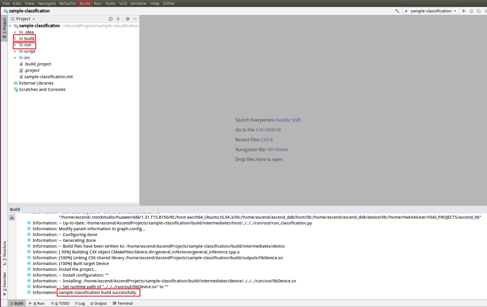

English|[中文](Readme_cn.md)

# Classification Network Application \(C++\)<a name="EN-US_TOPIC_0232644371"></a>

This application can run on the Atlas 200 DK or the AI acceleration cloud server to implement inference on a common classification network and output the first  _n_  inference results.

The applications in the current version branch adapt to  [DDK&RunTime](https://ascend.huawei.com/resources) **1.32.0.0 and later**.

## Prerequisites<a name="en-us_topic_0228461902_section137245294533"></a>

Before deploying this sample, ensure that:

-   Mind Studio  has been installed.
-   The Atlas 200 DK developer board has been connected to  Mind Studio, the cross compiler has been installed, the SD card has been prepared, and basic information has been configured.

## Deployment<a name="en-us_topic_0228461902_section412811285117"></a>

You can use either of the following methods:

1.  Quick deployment: visit  [https://github.com/Atlas200dk/faster-deploy](https://github.com/Atlas200dk/faster-deploy).

    > **NOTE:**   
    >-   The quick deployment script can be used to deploy multiple samples rapidly. Select  **classification**.  
    >-   The quick deployment script automatically completes code download, model conversion, and environment variable configuration. To learn about the detailed deployment process, select the common deployment mode. Go to  [2. Common deployment](#en-us_topic_0228461902_li3208251440).  

2.  <a name="en-us_topic_0228461902_li3208251440"></a>Common deployment: visit  [https://github.com/Atlas200dk/sample-README/tree/master/sample-classification](https://github.com/Atlas200dk/sample-README/tree/master/sample-classification).

    > **NOTE:**   
    >-   In this deployment mode, you need to manually download code, convert models, and configure environment variables. After that, you will have a better understanding of the process.  


## Build<a name="en-us_topic_0228461902_section18931344873"></a>

1.  Open the project.

    Go to the directory that stores the decompressed installation package as the Mind Studio installation user in CLI mode, for example,  **$HOME/MindStudio-ubuntu/bin**. Run the following command to start Mind Studio:

    **./MindStudio.sh**

    Open the  **sample-classification**  project, as shown in  [Figure 1](#en-us_topic_0228461902_en-us_topic_0203223265_fig11106241192810).

    **Figure  1**  Opening the classification project<a name="en-us_topic_0228461902_en-us_topic_0203223265_fig11106241192810"></a>  
    

2.  Configure project information in the  **src/param\_configure.conf**  file.

    **Figure  2**  Configuration file path<a name="en-us_topic_0228461902_fig0391184062214"></a>  
    

    The default configurations of the configuration file are as follows:

    ```
    remote_host=192.168.1.2
    model_name=alexnet.om
    ```

    -   **remote\_host**: IP address of the Atlas 200 DK developer board
    -   **model\_name**: offline model name

    > **NOTE:**   
    >-   All the three parameters must be set. Otherwise, the build fails.  
    >-   Do not use double quotation marks \(""\) during parameter settings.  
    >-   You can type only one model name in the configuration file. In this example, the AlexNet model is used as an example. You can replace it with a model listed in the common deployment by referring to the operation procedure.  
    >-   Modify the default configurations as required.  

3.  Run the  **deploy.sh**  script to adjust configuration parameters and download and compile the third-party library. Open the  **Terminal**  window of Mind Studio. By default, the home directory of the code is used. Run the  **deploy.sh**  script in the background to deploy the environment, as shown in  [Figure 3](#en-us_topic_0228461902_en-us_topic_0203223265_fig478266192619).

    **Figure  3**  Running the deploy.sh script<a name="en-us_topic_0228461902_en-us_topic_0203223265_fig478266192619"></a>  
    

    > **NOTE:**   
    >-   During the first deployment, if no third-party library is used, the system automatically downloads and builds the third-party library, which may take a long time. The third-party library can be directly used for the subsequent build.  
    >-   During deployment, select the IP address of the host that communicates with the developer board. Generally, the IP address is the IP address configured for the virtual NIC. If the IP address is in the same network segment as the IP address of the developer board, it is automatically selected for deployment. If they are not in the same network segment, you need to manually type the IP address of the host that communicates with the Atlas DK to complete the deployment.  

4.  Start building. Open Mind Studio and choose  **Build \> Build \> Build-Configuration**  from the main menu. The  **build**  and  **run**  folders are generated in the directory, as shown in  [Figure 4](#en-us_topic_0228461902_en-us_topic_0203223265_fig1741464713019).

    **Figure  4**  Build and file generating<a name="en-us_topic_0228461902_en-us_topic_0203223265_fig1741464713019"></a>  
    

    > **NOTICE:**   
    >When you build a project for the first time,  **Build \> Build**  is unavailable. You need to choose  **Build \> Edit Build Configuration**  to set parameters before the build.  

5.  Upload the images to be inferred to any directory of the  **HwHiAiUser**  user on the host side.

    The image requirements are as follows:

    -   Format: jpg, png, and bmp
    -   Width of the input image: an integer ranging from 16px to 4096px
    -   Height of the input image: an integer ranging from 16px to 4096px


## Run<a name="en-us_topic_0228461902_section372782554919"></a>

1.  On the toolbar of Mind Studio, click  **Run**  and choose  **Run \> Run 'sample-classification'**. As shown in  [Figure 5](#en-us_topic_0228461902_en-us_topic_0203223265_fig93931954162719), the executable application is running on the developer board.

    **Figure  5**  Running application<a name="en-us_topic_0228461902_en-us_topic_0203223265_fig93931954162719"></a>  
    

    You can ignore the error information reported during the execution because Mind Studio cannot transfer parameters for an executable application. In the preceding steps, the executable application and dependent library files are deployed to the developer board. You need to log in to the developer board in SSH mode and manually execute the files in the corresponding directory. For details, see the following steps.

2.  Log in to the host side as the  **HwHiAiUser**  user in SSH mode on Ubuntu Server where  Mind Studio  is located.

    **ssh HwHiAiUser@**_host\_ip_

    For the Atlas 200 DK, the default value of  _**host\_ip**_  is  **192.168.1.2**  \(USB connection mode\) or  **192.168.0.2**  \(NIC connection mode\).

3.  Go to the path of the executable files of the classification network application.

    **cd \~/HIAI\_PROJECTS/workspace\_mind\_studio/sample-classification\__XXXXX_/out**

    > **NOTE:**   
    >-   In this path,  _**XXXXX **_in** sample-classification\__XXXXX_**  is a combination of letters and digits generated randomly each time the application is built.  

4.  Run the application.

    Run the  **run\_classification.py**  script to print the inference result on the execution terminal.

    Command example:

    **python3 run\_classification.py -w  _227_   -h  _227_   -i** **_./example.jpg_  -n  _10_**

    -   **-w/model\_width**: width of the input image of a model. The value is an integer ranging from 16 to 4096.Here is the width of the input data required for the sample model alexnet.om: 227. If you use other models, please refer to https://bbs.huaweicloud.com/forum/thread-54058-1-1.html Input data width
    -   **-h/model\_height**: height of the input image of a model. The value is an integer ranging from 16 to 4096.Here is the sample model alexnet.om requires high input data: 227, if you use other models, please refer to https://bbs.huaweicloud.com/forum/thread-54058-1-1.html Input data high
    -   **-i/input\_path**: path of the input image. It can be a directory, indicating that all images in the current directory are used as input. \(Multiple inputs can be specified\).
    -   **-n/top\_n**: the first  _n_  inference results that are output

    For other parameters, run the  **python3 run\_classification.py --help**  command to check help information.


