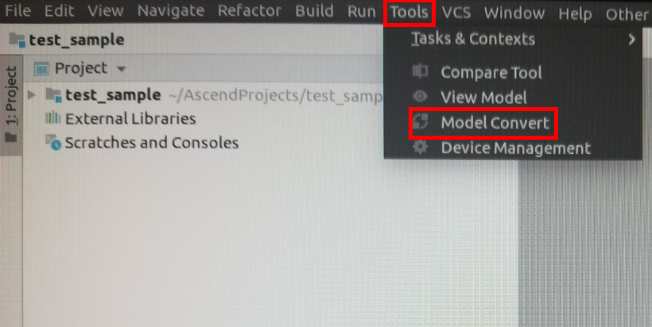
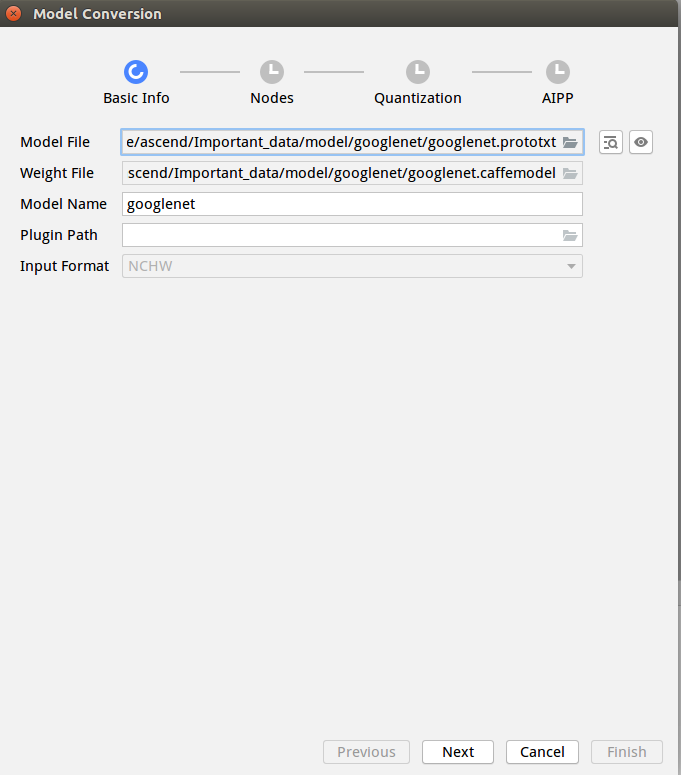
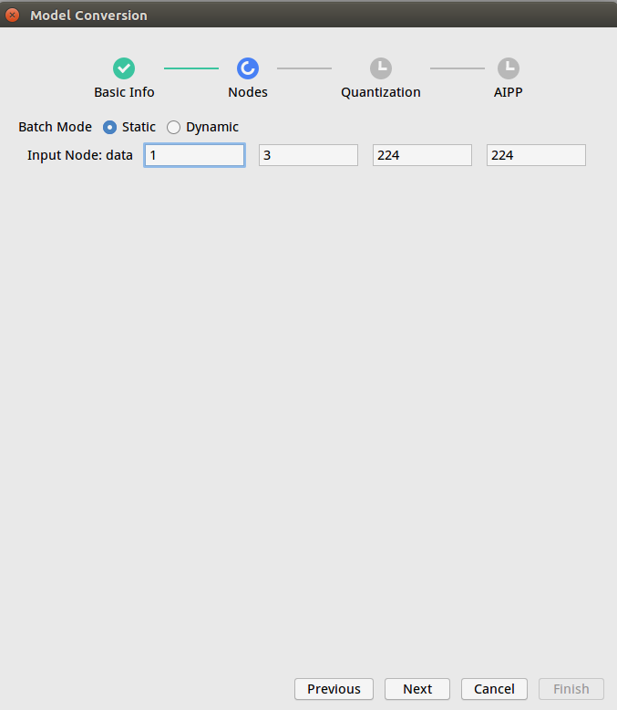
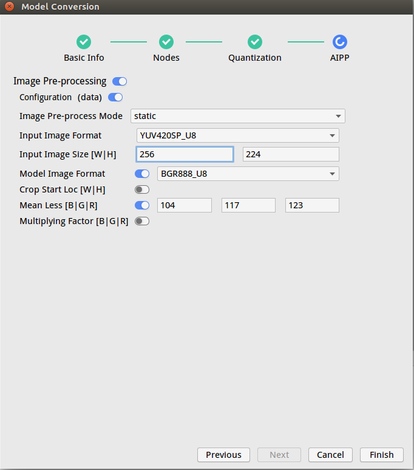
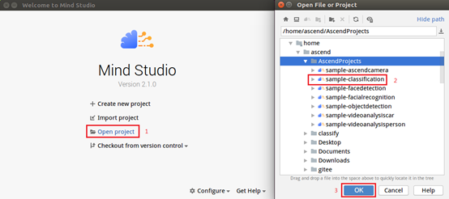

EN|[CN](Readme.md)

# Image Classification(C++)<a name="ZH-CN_TOPIC_0208837235"></a>

The classification application runs on the Atlas 200 DK or the AI acceleration cloud server and implements the inference function by using a common classification network, and the first n inference results are output.

## Prerequisites<a name="zh-cn_topic_0203223265_section137245294533"></a>

Before using an open source application, ensure that:

-   Mind Studio  has been installed.
-   The Atlas 200 DK developer board has been connected to  Mind Studio, the cross compiler has been installed, the SD card has been prepared, and basic information has been configured.。

## Software Preparation<a name="zh-cn_topic_0203223265_section181111827718"></a>

Before running the application, obtain the source code package and configure the environment as follows.

1.   <a name="zh-cn_topic_0203223265_li953280133816"></a>  Obtain the source code package.

     Download all the code in the sample-classification repository at [https://github.com/Atlas200DKTest/sample-classification/tree/1.3x.0.0/](https://github.com/Atlas200DKTest/sample-classification/tree/1.3x.0.0/)to any directory on Ubuntu Server where  Mind Studio  is located as the  Mind Studio  installation user, for example, $HOME/AscendProjects/sample-classification。

2.  <a name="zh-cn_topic_0203223265_li29641938112018"></a>Obtain the source network model required by the application.

    Obtain the source network model and its weight file used in the application by referring to  [Table 1](#zh-cn_topic_0203223265_table1119094515272),  and save them to any directory on the Ubuntu server where  Mind Studio  is located (for example, **$HOME/models/classification**.

     **Table  1**  Models used in the general  **classification**  network application

    <a name="zh-cn_topic_0203223265_table1119094515272"></a>
    <table><thead align="left"><tr id="zh-cn_topic_0203223265_row677354502719"><th class="cellrowborder" valign="top" width="12.85%" id="mcps1.2.4.1.1"><p id="zh-cn_topic_0203223265_p167731845122717"><a name="zh-cn_topic_0203223265_p167731845122717"></a><a name="zh-cn_topic_0203223265_p167731845122717"></a>Model Name</p>
    </th>
    <th class="cellrowborder" valign="top" width="12.57%" id="mcps1.2.4.1.2"><p id="zh-cn_topic_0203223265_p277317459276"><a name="zh-cn_topic_0203223265_p277317459276"></a><a name="zh-cn_topic_0203223265_p277317459276"></a>Model Description</p>
    </th>
    <th class="cellrowborder" valign="top" width="74.58%" id="mcps1.2.4.1.3"><p id="zh-cn_topic_0203223265_p9773114512270"><a name="zh-cn_topic_0203223265_p9773114512270"></a><a name="zh-cn_topic_0203223265_p9773114512270"></a>Model Download Path</p>
    </th>
    </tr>
    </thead>
    <tbody><tr id="zh-cn_topic_0203223265_row3122314144215"><td class="cellrowborder" valign="top" width="12.85%" headers="mcps1.2.4.1.1 "><p id="zh-cn_topic_0203223265_p14407251134314"><a name="zh-cn_topic_0203223265_p14407251134314"></a><a name="zh-cn_topic_0203223265_p14407251134314"></a>alexnet</p>
    </td>
    <td class="cellrowborder" valign="top" width="12.57%" headers="mcps1.2.4.1.2 "><p id="zh-cn_topic_0203223265_p116141194720"><a name="zh-cn_topic_0203223265_p116141194720"></a><a name="zh-cn_topic_0203223265_p116141194720"></a>Image&nbsp;classification&nbsp;inference&nbsp;model.</p>
    <p id="zh-cn_topic_0203223265_p86191184712"><a name="zh-cn_topic_0203223265_p86191184712"></a><a name="zh-cn_topic_0203223265_p86191184712"></a>It is a AlexNet model based on Caffe.</p>
    </td>
    <td class="cellrowborder" valign="top" width="74.58%" headers="mcps1.2.4.1.3 "><p id="zh-cn_topic_0203223265_p67311330479"><a name="zh-cn_topic_0203223265_p67311330479"></a><a name="zh-cn_topic_0203223265_p67311330479"></a>Download the source network model file and its weight file by referring to<strong id="en-us_topic_0182554620_b1195715819"><a name="en-us_topic_0182554620_b1195715819"></a><a name="en-us_topic_0182554620_b1195715819"></a> README.md</strong> in <a href="https://github.com/HuaweiAscendTest/models/tree/master/computer_vision/classification/alexnet" target="_blank" rel="noopener noreferrer">https://github.com/HuaweiAscendTest/models/tree/master/computer_vision/classification/alexnet</a>.</p>
    </td>
    </tr>
    <tr id="zh-cn_topic_0203223265_row2399521134819"><td class="cellrowborder" valign="top" width="12.85%" headers="mcps1.2.4.1.1 "><p id="zh-cn_topic_0203223265_p3400192113488"><a name="zh-cn_topic_0203223265_p3400192113488"></a><a name="zh-cn_topic_0203223265_p3400192113488"></a>caffenet</p>
    </td>
    <td class="cellrowborder" valign="top" width="12.57%" headers="mcps1.2.4.1.2 "><p id="zh-cn_topic_0203223265_p5645133234810"><a name="zh-cn_topic_0203223265_p5645133234810"></a><a name="zh-cn_topic_0203223265_p5645133234810"></a>Image&nbsp;classification&nbsp;inference&nbsp;model.</p>
    <p id="zh-cn_topic_0203223265_p14645153244816"><a name="zh-cn_topic_0203223265_p14645153244816"></a><a name="zh-cn_topic_0203223265_p14645153244816"></a>It is a CaffeNet model based on Caffe.</p>
    </td>
    <td class="cellrowborder" valign="top" width="74.58%" headers="mcps1.2.4.1.3 "><p id="zh-cn_topic_0203223265_p1537844912482"><a name="zh-cn_topic_0203223265_p1537844912482"></a><a name="zh-cn_topic_0203223265_p1537844912482"></a>Download the source network model file and its weight file by referring to<strong id="en-us_topic_0182554620_b67963501585"><a name="en-us_topic_0182554620_b67963501585"></a><a name="en-us_topic_0182554620_b67963501585"></a> README.md</strong> in <a href="https://github.com/HuaweiAscendTest/models/tree/master/computer_vision/classification/caffenet" target="_blank" rel="noopener noreferrer">https://github.com/HuaweiAscendTest/models/tree/master/computer_vision/classification/caffenet</a>.</p>
    </td>
    </tr>
    <tr id="zh-cn_topic_0203223265_row3773114518271"><td class="cellrowborder" valign="top" width="12.85%" headers="mcps1.2.4.1.1 "><p id="zh-cn_topic_0203223265_p17738455277"><a name="zh-cn_topic_0203223265_p17738455277"></a><a name="zh-cn_topic_0203223265_p17738455277"></a>densenet</p>
    </td>
    <td class="cellrowborder" valign="top" width="12.57%" headers="mcps1.2.4.1.2 "><p id="zh-cn_topic_0203223265_p16773124511270"><a name="zh-cn_topic_0203223265_p16773124511270"></a><a name="zh-cn_topic_0203223265_p16773124511270"></a>Image&nbsp;classification&nbsp;inference&nbsp;model.</p>
    <p id="zh-cn_topic_0203223265_p2773745162718"><a name="zh-cn_topic_0203223265_p2773745162718"></a><a name="zh-cn_topic_0203223265_p2773745162718"></a>It is a DenseNet121 model based on Caffe.</p>
    </td>
    <td class="cellrowborder" valign="top" width="74.58%" headers="mcps1.2.4.1.3 "><p id="zh-cn_topic_0203223265_p187731945132715"><a name="zh-cn_topic_0203223265_p187731945132715"></a><a name="zh-cn_topic_0203223265_p187731945132715"></a>Download the source network model file and its weight file by referring to<strong id="en-us_topic_0182554620_b133652512126"><a name="en-us_topic_0182554620_b133652512126"></a><a name="en-us_topic_0182554620_b133652512126"></a> README.md</strong> in<a href="https://github.com/HuaweiAscendTest/models/tree/master/computer_vision/classification/densenet" target="_blank" rel="noopener noreferrer">https://github.com/HuaweiAscendTest/models/tree/master/computer_vision/classification/densenet</a>.</p>
    </td>
    </tr>
    <tr id="zh-cn_topic_0203223265_row137731845122710"><td class="cellrowborder" valign="top" width="12.85%" headers="mcps1.2.4.1.1 "><p id="zh-cn_topic_0203223265_p477316457275"><a name="zh-cn_topic_0203223265_p477316457275"></a><a name="zh-cn_topic_0203223265_p477316457275"></a>googlenet</p>
    </td>
    <td class="cellrowborder" valign="top" width="12.57%" headers="mcps1.2.4.1.2 "><p id="zh-cn_topic_0203223265_p197731456270"><a name="zh-cn_topic_0203223265_p197731456270"></a><a name="zh-cn_topic_0203223265_p197731456270"></a>Image&nbsp;classification&nbsp;inference&nbsp;model.</p>
    <p id="zh-cn_topic_0203223265_p1877394515274"><a name="zh-cn_topic_0203223265_p1877394515274"></a><a name="zh-cn_topic_0203223265_p1877394515274"></a>It is a GoogLeNet model based on Caffe.</p>
    </td>
    <td class="cellrowborder" valign="top" width="74.58%" headers="mcps1.2.4.1.3 "><p id="zh-cn_topic_0203223265_p197738453275"><a name="zh-cn_topic_0203223265_p197738453275"></a><a name="zh-cn_topic_0203223265_p197738453275"></a>Download the source network model file and its weight file by referring to<strong id="en-us_topic_0182554620_b163671451151214"><a name="en-us_topic_0182554620_b163671451151214"></a><a name="en-us_topic_0182554620_b163671451151214"></a> README.md</strong> in<a href="https://github.com/HuaweiAscendTest/models/tree/master/computer_vision/classification/googlenet" target="_blank" rel="noopener noreferrer">https://github.com/HuaweiAscendTest/models/tree/master/computer_vision/classification/googlenet</a>.</p>
    </td>
    </tr>
    <tr id="zh-cn_topic_0203223265_row977374512716"><td class="cellrowborder" valign="top" width="12.85%" headers="mcps1.2.4.1.1 "><p id="zh-cn_topic_0203223265_p1977324512272"><a name="zh-cn_topic_0203223265_p1977324512272"></a><a name="zh-cn_topic_0203223265_p1977324512272"></a><span>inception_v2</span></p>
    </td>
    <td class="cellrowborder" valign="top" width="12.57%" headers="mcps1.2.4.1.2 "><p id="zh-cn_topic_0203223265_p14773445122712"><a name="zh-cn_topic_0203223265_p14773445122712"></a><a name="zh-cn_topic_0203223265_p14773445122712"></a>Image&nbsp;classification&nbsp;inference&nbsp;model.</p>
    <p id="zh-cn_topic_0203223265_p877311459270"><a name="zh-cn_topic_0203223265_p877311459270"></a><a name="zh-cn_topic_0203223265_p877311459270"></a>It is an Inception V2 model based on Caffe.</p>
    </td>
    <td class="cellrowborder" valign="top" width="74.58%" headers="mcps1.2.4.1.3 "><p id="zh-cn_topic_0203223265_p16773145162719"><a name="zh-cn_topic_0203223265_p16773145162719"></a><a name="zh-cn_topic_0203223265_p16773145162719"></a>Download the source network model file and its weight file by referring to<strong id="en-us_topic_0182554620_b237065110124"><a name="en-us_topic_0182554620_b237065110124"></a><a name="en-us_topic_0182554620_b237065110124"></a> README.md</strong> in <a href="https://github.com/HuaweiAscendTest/models/tree/master/computer_vision/classification/inception_v2" target="_blank" rel="noopener noreferrer">https://github.com/HuaweiAscendTest/models/tree/master/computer_vision/classification/inception_v2</a>.</p>
    </td>
    </tr>
    <tr id="zh-cn_topic_0203223265_row429165985115"><td class="cellrowborder" valign="top" width="12.85%" headers="mcps1.2.4.1.1 "><p id="zh-cn_topic_0203223265_p1050712711523"><a name="zh-cn_topic_0203223265_p1050712711523"></a><a name="zh-cn_topic_0203223265_p1050712711523"></a><span>inception_v3</span></p>
    </td>
    <td class="cellrowborder" valign="top" width="12.57%" headers="mcps1.2.4.1.2 "><p id="zh-cn_topic_0203223265_p18641141115218"><a name="zh-cn_topic_0203223265_p18641141115218"></a><a name="zh-cn_topic_0203223265_p18641141115218"></a>Image&nbsp;classification&nbsp;inference&nbsp;model.</p>
    <p id="zh-cn_topic_0203223265_p06411511105213"><a name="zh-cn_topic_0203223265_p06411511105213"></a><a name="zh-cn_topic_0203223265_p06411511105213"></a>It is an Inception V3 model based on Caffe.</p>
    </td>
    <td class="cellrowborder" valign="top" width="74.58%" headers="mcps1.2.4.1.3 "><p id="zh-cn_topic_0203223265_p1241971612520"><a name="zh-cn_topic_0203223265_p1241971612520"></a><a name="zh-cn_topic_0203223265_p1241971612520"></a>Download the source network model file and its weight file by referring to<strong id="en-us_topic_0182554620_b8944142410596"><a name="en-us_topic_0182554620_b8944142410596"></a><a name="en-us_topic_0182554620_b8944142410596"></a> README.md</strong> in <a href="https://github.com/HuaweiAscendTest/models/tree/master/computer_vision/classification/inception_v3" target="_blank" rel="noopener noreferrer">https://github.com/HuaweiAscendTest/models/tree/master/computer_vision/classification/inception_v3</a>.</p>
    </td>
    </tr>
    <tr id="zh-cn_topic_0203223265_row6482142185210"><td class="cellrowborder" valign="top" width="12.85%" headers="mcps1.2.4.1.1 "><p id="zh-cn_topic_0203223265_p12508168115214"><a name="zh-cn_topic_0203223265_p12508168115214"></a><a name="zh-cn_topic_0203223265_p12508168115214"></a><span>inception_v4</span></p>
    </td>
    <td class="cellrowborder" valign="top" width="12.57%" headers="mcps1.2.4.1.2 "><p id="zh-cn_topic_0203223265_p8785612105217"><a name="zh-cn_topic_0203223265_p8785612105217"></a><a name="zh-cn_topic_0203223265_p8785612105217"></a>Image&nbsp;classification&nbsp;inference&nbsp;model.</p>
    <p id="zh-cn_topic_0203223265_p47851512105212"><a name="zh-cn_topic_0203223265_p47851512105212"></a><a name="zh-cn_topic_0203223265_p47851512105212"></a>It is an Inception V4 model based on Caffe.</p>
    </td>
    <td class="cellrowborder" valign="top" width="74.58%" headers="mcps1.2.4.1.3 "><p id="zh-cn_topic_0203223265_p1028761705212"><a name="zh-cn_topic_0203223265_p1028761705212"></a><a name="zh-cn_topic_0203223265_p1028761705212"></a>Download the source network model file and its weight file by referring to<strong id="en-us_topic_0182554620_b8720202695912"><a name="en-us_topic_0182554620_b8720202695912"></a><a name="en-us_topic_0182554620_b8720202695912"></a> README.md</strong> in <a href="https://github.com/HuaweiAscendTest/models/tree/master/computer_vision/classification/inception_v4" target="_blank" rel="noopener noreferrer">https://github.com/HuaweiAscendTest/models/tree/master/computer_vision/classification/inception_v4</a></p>
    </td>
    </tr>
    <tr id="zh-cn_topic_0203223265_row77732045152717"><td class="cellrowborder" valign="top" width="12.85%" headers="mcps1.2.4.1.1 "><p id="zh-cn_topic_0203223265_p0773114572715"><a name="zh-cn_topic_0203223265_p0773114572715"></a><a name="zh-cn_topic_0203223265_p0773114572715"></a><span>mobilenet_v1</span></p>
    </td>
    <td class="cellrowborder" valign="top" width="12.57%" headers="mcps1.2.4.1.2 "><p id="zh-cn_topic_0203223265_p11774645162715"><a name="zh-cn_topic_0203223265_p11774645162715"></a><a name="zh-cn_topic_0203223265_p11774645162715"></a>Image&nbsp;classification&nbsp;inference&nbsp;model.</p>
    <p id="zh-cn_topic_0203223265_p47741455273"><a name="zh-cn_topic_0203223265_p47741455273"></a><a name="zh-cn_topic_0203223265_p47741455273"></a>It is a MobileNet V1 model based on Caffe.</p>
    </td>
    <td class="cellrowborder" valign="top" width="74.58%" headers="mcps1.2.4.1.3 "><p id="zh-cn_topic_0203223265_p5586471511"><a name="zh-cn_topic_0203223265_p5586471511"></a><a name="zh-cn_topic_0203223265_p5586471511"></a>Download the source network model file and its weight file by referring to<strong id="en-us_topic_0182554620_b11372951161212"><a name="en-us_topic_0182554620_b11372951161212"></a><a name="en-us_topic_0182554620_b11372951161212"></a> README.md</strong> in <a href="https://github.com/HuaweiAscendTest/models/tree/master/computer_vision/classification/mobilenet_v1" target="_blank" rel="noopener noreferrer">https://github.com/HuaweiAscendTest/models/tree/master/computer_vision/classification/mobilenet_v1</a>.</p>
    </td>
    </tr>
    <tr id="zh-cn_topic_0203223265_row12774164515277"><td class="cellrowborder" valign="top" width="12.85%" headers="mcps1.2.4.1.1 "><p id="zh-cn_topic_0203223265_p187741345112718"><a name="zh-cn_topic_0203223265_p187741345112718"></a><a name="zh-cn_topic_0203223265_p187741345112718"></a><span>mobilenet_v2</span></p>
    </td>
    <td class="cellrowborder" valign="top" width="12.57%" headers="mcps1.2.4.1.2 "><p id="zh-cn_topic_0203223265_p277414519274"><a name="zh-cn_topic_0203223265_p277414519274"></a><a name="zh-cn_topic_0203223265_p277414519274"></a>Image&nbsp;classification&nbsp;inference&nbsp;model.</p>
    <p id="zh-cn_topic_0203223265_p8774174502713"><a name="zh-cn_topic_0203223265_p8774174502713"></a><a name="zh-cn_topic_0203223265_p8774174502713"></a>It is a MobileNet V2 model based on Caffe.</p>
    </td>
    <td class="cellrowborder" valign="top" width="74.58%" headers="mcps1.2.4.1.3 "><p id="zh-cn_topic_0203223265_p1677414514274"><a name="zh-cn_topic_0203223265_p1677414514274"></a><a name="zh-cn_topic_0203223265_p1677414514274"></a>Download the source network model file and its weight file by referring to<strong id="en-us_topic_0182554620_b113751751171215"><a name="en-us_topic_0182554620_b113751751171215"></a><a name="en-us_topic_0182554620_b113751751171215"></a> README.md</strong> in<a href="https://github.com/HuaweiAscendTest/models/tree/master/computer_vision/classification/mobilenet_v2" target="_blank" rel="noopener noreferrer">https://github.com/HuaweiAscendTest/models/tree/master/computer_vision/classification/mobilenet_v2</a>.</p>
    </td>
    </tr>
    <tr id="zh-cn_topic_0203223265_row1577434516271"><td class="cellrowborder" valign="top" width="12.85%" headers="mcps1.2.4.1.1 "><p id="zh-cn_topic_0203223265_p3774194512713"><a name="zh-cn_topic_0203223265_p3774194512713"></a><a name="zh-cn_topic_0203223265_p3774194512713"></a><span>resnet18</span></p>
    </td>
    <td class="cellrowborder" valign="top" width="12.57%" headers="mcps1.2.4.1.2 "><p id="zh-cn_topic_0203223265_p7774245122713"><a name="zh-cn_topic_0203223265_p7774245122713"></a><a name="zh-cn_topic_0203223265_p7774245122713"></a>Image&nbsp;classification&nbsp;inference&nbsp;model.</p>
    <p id="zh-cn_topic_0203223265_p577494517271"><a name="zh-cn_topic_0203223265_p577494517271"></a><a name="zh-cn_topic_0203223265_p577494517271"></a>It is a ResNet 18 model based on Caffe.</p>
    </td>
    <td class="cellrowborder" valign="top" width="74.58%" headers="mcps1.2.4.1.3 "><p id="zh-cn_topic_0203223265_p16774144510270"><a name="zh-cn_topic_0203223265_p16774144510270"></a><a name="zh-cn_topic_0203223265_p16774144510270"></a>Download the source network model file and its weight file by referring to<strong id="en-us_topic_0182554620_b9376185110123"><a name="en-us_topic_0182554620_b9376185110123"></a><a name="en-us_topic_0182554620_b9376185110123"></a> README.md</strong> in <a href="https://github.com/HuaweiAscendTest/models/tree/master/computer_vision/classification/resnet18" target="_blank" rel="noopener noreferrer">https://github.com/HuaweiAscendTest/models/tree/master/computer_vision/classification/resnet18</a>.</p>
    </td>
    </tr>
    <tr id="zh-cn_topic_0203223265_row377414452276"><td class="cellrowborder" valign="top" width="12.85%" headers="mcps1.2.4.1.1 "><p id="zh-cn_topic_0203223265_p10774545142714"><a name="zh-cn_topic_0203223265_p10774545142714"></a><a name="zh-cn_topic_0203223265_p10774545142714"></a><span>resnet50</span></p>
    </td>
    <td class="cellrowborder" valign="top" width="12.57%" headers="mcps1.2.4.1.2 "><p id="zh-cn_topic_0203223265_p97741245142712"><a name="zh-cn_topic_0203223265_p97741245142712"></a><a name="zh-cn_topic_0203223265_p97741245142712"></a>Image&nbsp;classification&nbsp;inference&nbsp;model.</p>
    <p id="zh-cn_topic_0203223265_p177412456271"><a name="zh-cn_topic_0203223265_p177412456271"></a><a name="zh-cn_topic_0203223265_p177412456271"></a>It is a ResNet 50 model based on Caffe.</p>
    </td>
    <td class="cellrowborder" valign="top" width="74.58%" headers="mcps1.2.4.1.3 "><p id="zh-cn_topic_0203223265_p57747459272"><a name="zh-cn_topic_0203223265_p57747459272"></a><a name="zh-cn_topic_0203223265_p57747459272"></a>Download the source network model file and its weight file by referring to<strong id="en-us_topic_0182554620_b837835111214"><a name="en-us_topic_0182554620_b837835111214"></a><a name="en-us_topic_0182554620_b837835111214"></a> README.md</strong> in <a href="https://github.com/HuaweiAscendTest/models/tree/master/computer_vision/classification/resnet50" target="_blank" rel="noopener noreferrer">https://github.com/HuaweiAscendTest/models/tree/master/computer_vision/classification/resnet50</a>.</p>
    </td>
    </tr>
    <tr id="zh-cn_topic_0203223265_row377484514279"><td class="cellrowborder" valign="top" width="12.85%" headers="mcps1.2.4.1.1 "><p id="zh-cn_topic_0203223265_p1777454516275"><a name="zh-cn_topic_0203223265_p1777454516275"></a><a name="zh-cn_topic_0203223265_p1777454516275"></a><span>resnet101</span></p>
    </td>
    <td class="cellrowborder" valign="top" width="12.57%" headers="mcps1.2.4.1.2 "><p id="zh-cn_topic_0203223265_p15774124516274"><a name="zh-cn_topic_0203223265_p15774124516274"></a><a name="zh-cn_topic_0203223265_p15774124516274"></a>Image&nbsp;classification&nbsp;inference&nbsp;model.</p>
    <p id="zh-cn_topic_0203223265_p7774134552720"><a name="zh-cn_topic_0203223265_p7774134552720"></a><a name="zh-cn_topic_0203223265_p7774134552720"></a>It is a ResNet 101 model based on Caffe.</p>
    </td>
    <td class="cellrowborder" valign="top" width="74.58%" headers="mcps1.2.4.1.3 "><p id="zh-cn_topic_0203223265_p117741545132710"><a name="zh-cn_topic_0203223265_p117741545132710"></a><a name="zh-cn_topic_0203223265_p117741545132710"></a>Download the source network model file and its weight file by referring to<strong id="en-us_topic_0182554620_b163801051121213"><a name="en-us_topic_0182554620_b163801051121213"></a><a name="en-us_topic_0182554620_b163801051121213"></a> README.md</strong> in <a href="https://github.com/HuaweiAscendTest/models/tree/master/computer_vision/classification/resnet101" target="_blank" rel="noopener noreferrer">https://github.com/HuaweiAscendTest/models/tree/master/computer_vision/classification/resnet101</a>.</p>
    </td>
    </tr>
    <tr id="zh-cn_topic_0203223265_row14774154513279"><td class="cellrowborder" valign="top" width="12.85%" headers="mcps1.2.4.1.1 "><p id="zh-cn_topic_0203223265_p1077413452272"><a name="zh-cn_topic_0203223265_p1077413452272"></a><a name="zh-cn_topic_0203223265_p1077413452272"></a><span>resnet15</span>2</p>
    </td>
    <td class="cellrowborder" valign="top" width="12.57%" headers="mcps1.2.4.1.2 "><p id="zh-cn_topic_0203223265_p177434517275"><a name="zh-cn_topic_0203223265_p177434517275"></a><a name="zh-cn_topic_0203223265_p177434517275"></a>Image&nbsp;classification&nbsp;inference&nbsp;model.</p>
    <p id="zh-cn_topic_0203223265_p877515459276"><a name="zh-cn_topic_0203223265_p877515459276"></a><a name="zh-cn_topic_0203223265_p877515459276"></a>It is a ResNet 152 model based on Caffe.</p>
    </td>
    <td class="cellrowborder" valign="top" width="74.58%" headers="mcps1.2.4.1.3 "><p id="zh-cn_topic_0203223265_p777514582712"><a name="zh-cn_topic_0203223265_p777514582712"></a><a name="zh-cn_topic_0203223265_p777514582712"></a>Download the source network model file and its weight file by referring to<strong id="en-us_topic_0182554620_b10381751171220"><a name="en-us_topic_0182554620_b10381751171220"></a><a name="en-us_topic_0182554620_b10381751171220"></a> README.md</strong> in <a href="https://github.com/HuaweiAscendTest/models/tree/master/computer_vision/classification/resnet152" target="_blank" rel="noopener noreferrer">https://github.com/HuaweiAscendTest/models/tree/master/computer_vision/classification/resnet152</a>.</p>
    </td>
    </tr>
    <tr id="zh-cn_topic_0203223265_row37752450270"><td class="cellrowborder" valign="top" width="12.85%" headers="mcps1.2.4.1.1 "><p id="zh-cn_topic_0203223265_p977544513278"><a name="zh-cn_topic_0203223265_p977544513278"></a><a name="zh-cn_topic_0203223265_p977544513278"></a><span>vgg16</span></p>
    </td>
    <td class="cellrowborder" valign="top" width="12.57%" headers="mcps1.2.4.1.2 "><p id="zh-cn_topic_0203223265_p1177514522713"><a name="zh-cn_topic_0203223265_p1177514522713"></a><a name="zh-cn_topic_0203223265_p1177514522713"></a>Image&nbsp;classification&nbsp;inference&nbsp;model.</p>
    <p id="zh-cn_topic_0203223265_p10775194582713"><a name="zh-cn_topic_0203223265_p10775194582713"></a><a name="zh-cn_topic_0203223265_p10775194582713"></a>It is a VGG16 model based on Caffe.</p>
    </td>
    <td class="cellrowborder" valign="top" width="74.58%" headers="mcps1.2.4.1.3 "><p id="zh-cn_topic_0203223265_p18775124582720"><a name="zh-cn_topic_0203223265_p18775124582720"></a><a name="zh-cn_topic_0203223265_p18775124582720"></a>Download the source network model file and its weight file by referring to<strong id="en-us_topic_0182554620_b113831451181215"><a name="en-us_topic_0182554620_b113831451181215"></a><a name="en-us_topic_0182554620_b113831451181215"></a> README.md</strong> in  <a href="https://github.com/HuaweiAscendTest/models/tree/master/computer_vision/classification/vgg16" target="_blank" rel="noopener noreferrer">https://github.com/HuaweiAscendTest/models/tree/master/computer_vision/classification/vgg16</a>.</p>
    </td>
    </tr>
    <tr id="zh-cn_topic_0203223265_row2775194518272"><td class="cellrowborder" valign="top" width="12.85%" headers="mcps1.2.4.1.1 "><p id="zh-cn_topic_0203223265_p5775154516272"><a name="zh-cn_topic_0203223265_p5775154516272"></a><a name="zh-cn_topic_0203223265_p5775154516272"></a><span>vgg19</span></p>
    </td>
    <td class="cellrowborder" valign="top" width="12.57%" headers="mcps1.2.4.1.2 "><p id="zh-cn_topic_0203223265_p0775204532711"><a name="zh-cn_topic_0203223265_p0775204532711"></a><a name="zh-cn_topic_0203223265_p0775204532711"></a>Image&nbsp;classification&nbsp;inference&nbsp;model.</p>
    <p id="zh-cn_topic_0203223265_p1477554519275"><a name="zh-cn_topic_0203223265_p1477554519275"></a><a name="zh-cn_topic_0203223265_p1477554519275"></a>It is a VGG19 model based on Caffe.</p>
    </td>
    <td class="cellrowborder" valign="top" width="74.58%" headers="mcps1.2.4.1.3 "><p id="zh-cn_topic_0203223265_p777554542713"><a name="zh-cn_topic_0203223265_p777554542713"></a><a name="zh-cn_topic_0203223265_p777554542713"></a>Download the source network model file and its weight file by referring to<strong id="en-us_topic_0182554620_b19384451171215"><a name="en-us_topic_0182554620_b19384451171215"></a><a name="en-us_topic_0182554620_b19384451171215"></a> README.md</strong> in <a href="https://github.com/HuaweiAscendTest/models/tree/master/computer_vision/classification/vgg19" target="_blank" rel="noopener noreferrer">https://github.com/HuaweiAscendTest/models/tree/master/computer_vision/classification/vgg19</a>.</p>
    </td>
    </tr>
    <tr id="zh-cn_topic_0203223265_row17513194404914"><td class="cellrowborder" valign="top" width="12.85%" headers="mcps1.2.4.1.1 "><p id="zh-cn_topic_0203223265_p7513164419495"><a name="zh-cn_topic_0203223265_p7513164419495"></a><a name="zh-cn_topic_0203223265_p7513164419495"></a>squeezenet</p>
    </td>
    <td class="cellrowborder" valign="top" width="12.57%" headers="mcps1.2.4.1.2 "><p id="zh-cn_topic_0203223265_p1315111145015"><a name="zh-cn_topic_0203223265_p1315111145015"></a><a name="zh-cn_topic_0203223265_p1315111145015"></a>Image&nbsp;classification&nbsp;inference&nbsp;model.</p>
    <p id="zh-cn_topic_0203223265_p1515131114501"><a name="zh-cn_topic_0203223265_p1515131114501"></a><a name="zh-cn_topic_0203223265_p1515131114501"></a>It is a SqueezeNet model based on Caffe.</p>
    </td>
    <td class="cellrowborder" valign="top" width="74.58%" headers="mcps1.2.4.1.3 "><p id="zh-cn_topic_0203223265_p16265437125015"><a name="zh-cn_topic_0203223265_p16265437125015"></a><a name="zh-cn_topic_0203223265_p16265437125015"></a>Download the source network model file and its weight file by referring to<strong id="en-us_topic_0182554620_b17968122318"><a name="en-us_topic_0182554620_b17968122318"></a><a name="en-us_topic_0182554620_b17968122318"></a> README.md</strong> in <a href="https://github.com/HuaweiAscendTest/models/tree/master/computer_vision/classification/squeezenet" target="_blank" rel="noopener noreferrer">https://github.com/HuaweiAscendTest/models/tree/master/computer_vision/classification/squeezenet</a>.</p>
    </td>
    </tr>
    <tr id="zh-cn_topic_0203223265_row17757454270"><td class="cellrowborder" valign="top" width="12.85%" headers="mcps1.2.4.1.1 "><p id="zh-cn_topic_0203223265_p17759452279"><a name="zh-cn_topic_0203223265_p17759452279"></a><a name="zh-cn_topic_0203223265_p17759452279"></a><span>dpn98</span></p>
    </td>
    <td class="cellrowborder" valign="top" width="12.57%" headers="mcps1.2.4.1.2 "><p id="zh-cn_topic_0203223265_p4775545162716"><a name="zh-cn_topic_0203223265_p4775545162716"></a><a name="zh-cn_topic_0203223265_p4775545162716"></a>Image&nbsp;classification&nbsp;inference&nbsp;model.</p>
    <p id="zh-cn_topic_0203223265_p1577504516278"><a name="zh-cn_topic_0203223265_p1577504516278"></a><a name="zh-cn_topic_0203223265_p1577504516278"></a>It is a DPN-98 model based on Caffe.</p>
    </td>
    <td class="cellrowborder" valign="top" width="74.58%" headers="mcps1.2.4.1.3 "><p id="zh-cn_topic_0203223265_p19776154592711"><a name="zh-cn_topic_0203223265_p19776154592711"></a><a name="zh-cn_topic_0203223265_p19776154592711"></a>Download the source network model file and its weight file by referring to<strong id="en-us_topic_0182554620_b138619511120"><a name="en-us_topic_0182554620_b138619511120"></a><a name="en-us_topic_0182554620_b138619511120"></a> README.md</strong> in <a href="https://github.com/HuaweiAscendTest/models/tree/master/computer_vision/classification/dpn98" target="_blank" rel="noopener noreferrer">https://github.com/HuaweiAscendTest/models/tree/master/computer_vision/classification/dpn98</a>.</p>
    </td>
    </tr>
    </tbody>
    </table>

3.  Log in to Ubuntu Server where Mind Studio is located as the Mind Studio installation user, confirm current DDK version and set the  environment variable  **DDK\_HOME**, **tools\_version**, **NPU\_DEVICE\_LIB** and **LD\_LIBRARY\_PATH**.

    1.  <a name="zh-cn_topic_0203223265_zh-cn_topic_0203223294_li61417158198"></a>Find current DDK version number.


        Current DDK version number can be obtained by either Mind studio tool or DDK packages.

        -    Using Mind studio tool.

             choose **File \> Settings \> System Settings \> Ascend DDK** from the main menu of Mind Studio, DDK version inquiry page will display as [Figure 1](zh-cn_topic_0203223294.md#fig94023140222).

             **Figure 1** DDK version inquiry page<a name="zh-cn_topic_0203223265_zh-cn_topic_0203223294_fig17553193319118"></a>  
             

             **DDK Version** shows in this page is current DDK version, for example, **1.31.T15.B150**.

        -   Using DDK package
             
             Obtain DDK version by installed DDK package name.
             
             The format of DDK package name is: **Ascend\_DDK-\{software version}-\{interface version}-x86\_64.ubuntu16.04.tar.gz**
             
             Where **software version** represents the DDK version.
             
             For example:
             
             If the name of DDK package is **Ascend\_DDK-1.31.T15.B150-1.1.1-x86\_64.ubuntu16.04.tar.gz**, the DDK version would be **1.31.T15.B150**.

    2.  Set the environment variable.
        

        **vim \~/.bashrc**

        Run the following commands to add the environment variables  **DDK\_HOME**  and  **LD\_LIBRARY\_PATH**  to the last line:

        **export tools\_version=_1.31.X.X_**

        **export DDK\_HOME=\\$HOME/.mindstudio/huawei/ddk/\\$tools\_version/ddk**

        **export NPU\_DEVICE\_LIB=$DDK\_HOME/../RC/host-aarch64\_Ubuntu16.04.3/lib**

        **export LD\_LIBRARY\_PATH=$DDK\_HOME/lib/x86\_64-linux-gcc5.4**

        > **NOTE：**   
        >-   **_1.31.X.X_** is the DDK version obtained from [Figure 1](#zh-cn_topic_0203223265_zh-cn_topic_0203223294_li61417158198), it needs be filled according to the inquiry result，for example, **1.31.T15.B150**  

        >-   If the environment variables have been added, this step can be skipped.

        Enter  **:wq!**  to save and exit.

        Run the following command for the environment variable to take effect:
         
        **source \~/.bashrc**

4. Convert the source network to a model supported by Ascend AI processor.

    1.  Choose  **Tool \> Convert Model**  from the main menu of  Mind Studio. The  **Convert Model**  page is displayed.

        

    2.   On the  **Convert Model**  page, perform model conversion configuration.
         -   set  **Model File** to the model file downloaded in  [Step 2](#zh-cn_topic_0203223265_li29641938112018), the weight file would be automatically matched and filled in **Weight File**.
         -   Set **Model Name** to model name in [Table 1](#zh-cn_topic_0203223265_table1119094515272).

             

         -  For **googlenet**、**inception\_v2**、**resent18**, a general classification network application processes one image at a time. Therefore, the value of  **N**  in  **Input Shape**  must be set to  **1**  during conversion, **Input Image Size\[W\]\[H\]** in AIPP configuration needs to be set to 256、224 seperately,  128 \*16 alignment is required here,  for **Model Image Format**, select BGR888\_U8.

              **Figure 2**  Nodes configuration example<a name="zh-cn_topic_0203223265_fig95695336322"></a>  
             

             **图 3**  AIPP configuration example<a name="zh-cn_topic_0203223265_fig14632122193310"></a>  
             

   3.   Click **OK** to start model conversion.

        After successful conversion, a .om offline model is generated in:**$HOME/modelzoo/XXX/device** directory.
        
    > **NOTE：**   
    >-   The specific meaning and parameter description in each step of **Mind Studio** model conversion can refer to[https://ascend.huawei.com/doc/mindstudio/2.1.0\(beta\)/zh/zh-cn\_topic\_0188462651.html](https://ascend.huawei.com/doc/mindstudio/2.1.0(beta)/zh/zh-cn_topic_0188462651.html)  
    >-  XXX indicates the name of currently converted model, for example, googlenet.om is saved in: **$HOME/modelzoo/googlenet/device**.  
5.  <a name="zh-cn_topic_0203223265_li470213205618"></a>upload converted model file(.om file) to “**sample-classification/script**” directory  in the source code path in [Step 1](#zh-cn_topic_0203223265_li953280133816).

## Compile<a name="zh-cn_topic_0203223265_section18931344873"></a>

1.  Open the corresponding project.

       Enter the “**MindStudio-ubuntu/bin**” directory after decompressing the installation package in the command line, for example, **$HOME/MindStudio-ubuntu/bin**. Run the following command to start **Mind Studio**:

    **./MindStudio.sh**

    After successfully starting Mind Studio, open **sample-classification**project，as shown in [Figure 4](#zh-cn_topic_0203223265_fig11106241192810).

    **Figure 4**  Open classification project<a name="zh-cn_topic_0203223265_fig11106241192810"></a>  
    

2.  Configure related project information in **src/param\_configure.conf**.

    **Figure 5**  Configuration file path<a name="zh-cn_topic_0203223265_fig0391184062214"></a>  
    

    The configuration file is as follows:

    ```
    remote_host=
    model_name=
    ```

    Following parameter configuration needs to be added manually：

    -   remote\_host：this parameter indicates the IP address of Atlas 200 DK developer board.
    -   model\_name : name of the offline model

    An example of configuration is as follows:

    ```
    remote_host=192.168.1.2
    model_name=googlenet.om
    ```

    > **NOTE：**   
    >-   All the parameters must be filled in，otherwise build cannot be passed.
    >-   Note that the "" symbol is no need to be used when filling in parameters.
    >-   Only one single model name can be filled in the configuration file, the filled model must be one of the models saved in  [Step 5](#zh-cn_topic_0203223265_li470213205618). **googlenet** is used as an example here, it can be replaced by other models listed in this application. 
    
3.  Begin to compile, open **Mind Studio** tool, click **Build \> Build \> Build-Configuration** in the toolbar, shown as [Figure 6](#zh-cn_topic_0203223265_fig1741464713019), **build** and **run** folders will be generated under the directory.

    **Figure 6**  Compilation operation and generated files<a name="zh-cn_topic_0203223265_fig1741464713019"></a>  
    

    > **NOTE：**   
    >When you compile the project for the first time, **Build \> Build** is gray and not clickable. Your need to click **Build \> Edit Build Configuration**, configure the compilation parameters and then compile.  
    >  

4. Upload the images to be inferred to the directory of the  **HwHiAiUser**  user on the host.

    The image requirements are as follows:

    -   Format: JPG, PNG, and BMP.
    -   Width of the input image: the value is an integer ranging from 16px to 4096px.
    -   Height of the input image: the value is an integer ranging from 16px to 4096px.


## Running<a name="zh-cn_topic_0203223265_section372782554919"></a>

1. Find the **Run** button in the toolbar in **Mind Studio** tool, click **Run \> Run 'sample-classification'**, as shown in[Figure 7](#zh-cn_topic_0203223265_fig93931954162719), the executable program has been executed on the developer board.

    **Figure 7**  Executed program<a name="zh-cn_topic_0203223265_fig93931954162719"></a>  
    

    Please ignore the above error, because **Mind Studio** cannot pass parameters for executable programs.  The above steps are to deploy the executable program and the dependent library files to the developer board. This step requires ssh to developer board to the corresponding directory file and execute manually. For details, refer to the following steps.

2.  Log in to the Host as the  **HwHiAiUser**  user in SSH mode on Ubuntu Server where  Mind Studio  is located.

    **ssh HwHiAiUser@**_host\_ip_

    For the Atlas 200 DK, the default value of  _**host\_ip**_  is  **192.168.1.2**  \(USB connection mode\) or  **192.168.0.2**  \(NIC connection mode\).

3.  Go to the path of the executable file of classification application.

    **cd \~/HIAI\_PROJECTS/workspace\_mind\_studio/classification/out**

4.  Run the application.


    Run the  **run\_classification.py**  script to print the inference result on the execution terminal.

    Example command:


    **python3 run\_classification.py -w  _224_  -h  _224_  -i** **_./example.jpg_  -n  _10_**

    -   **-w/model\_width**: width of the input image of a model. The value is an integer ranging from 16px to 4096px. Obtain the input width and height required by each model by referring to the readme file of each model file on github. For details, see  [Table 1](#zh-cn_topic_0203223265_table1119094515272)
    -   **-h/model\_height**: height of the input image of a model. The value is an integer ranging from 16px to 4096px. Obtain the input width and height required by each model by referring to the readme file of each model file on github. For details, see  [Table 1](#zh-cn_topic_0203223265_table1119094515272)
    -   **-i/input\_path**: path of the input image. It can be a directory, indicating that all images in the current directory are used as input (Multiple inputs can be specified).
    -   **-n/top\_n**: the first  _n_  inference results that are output

    For other parameters, run the  **python3 run\_classification.py --help** command. For details, see the help information.


